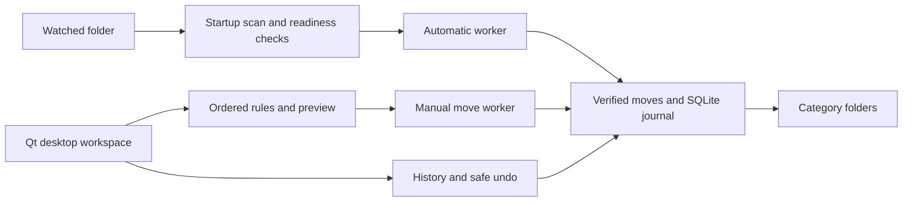

<div align="center">


# Downloads Organizer

**A calmer downloads folder. Every file stays on your device.**

Preview file moves, build your own rules, and let a local desktop app handle the routine sorting—with history and safe undo.


[](LICENSE)


[Download 1.0.0](https://github.com/kashnordeen/downloads-organizer/releases/tag/v1.0.0) · [How it works](#daily-use) · [Build and install](docs/BUILDING.md) · [Validation](VALIDATION.md)


*Actual application UI with demonstration files. The tour loops automatically.*

</div>

## Built for everyday downloads

| Capability | What you control |
| :--- | :--- |
| **Preview first** | See destinations and skipped reasons before confirming a manual move. |
| **Rules that make sense** | Add or edit rules with a guided form and folder picker. The first enabled rule wins. |
| **First-launch guidance** | Confirm a folder, then follow a five-step tour of the workspace. Automatic sorting starts off. |
| **Automatic catch-up** | On reopening, ready files downloaded while stopped are processed before later ready arrivals. |
| **Background sorting** | Keep the app in the system tray; optionally start it at login. |
| **History and undo** | Restore unchanged files, or resolve reviewed moves by moving to the destination or leaving the file in Downloads. |
| **A focused workspace** | Separate Preview, Rules, History, and Settings pages, with blue light/dark themes. |
| **Visible progress and cancellation** | See the current file, phase, percentage, and bytes. Cancel stops remaining files and interrupts copying and hashing. |
| **Optional update notices** | Check stable GitHub releases on startup or manually. You choose when to download and install. |

No account, cloud service, telemetry, or administrator privileges are required for normal operation. Python is included in the downloads.

## Platform status

| Platform | Current status |
| :--- | :--- |
| **Windows x64** | Per-user Setup installer and portable ZIP. CI tests on Windows Server 2022; local source UI tested on Windows 11. Intended minimum: Windows 10 version 2004. |
| **macOS Intel / Apple Silicon** | Separate x64 and arm64 DMGs with app bundles. CI tests on macOS 15. |
| **Linux x64** | Debian/Ubuntu package and portable tar.gz. CI tests on Ubuntu 22.04; native display libraries and glibc 2.34+ required. |

Version **1.0.0** is the first stable release. Windows builds are unsigned; macOS builds are ad-hoc signed but lack Developer ID signing and notarization. OS security policies may warn or block installation. Earlier OS versions, real desktop tray/login/reboot behavior on macOS/Linux, and signed installation remain manual validation tasks. See [installation guidance](docs/BUILDING.md).

The source branch prepares **1.1.0** with the redesigned interface, progress, cancellation, and update notices. These features reach existing users after they install the new version; the 1.0.0 download does not contain them.

## Get started

[Download 1.0.0 for your OS](https://github.com/kashnordeen/downloads-organizer/releases/tag/v1.0.0), install it, and open **Downloads Organizer**. Confirm the folder on first launch, follow the guided tour, and refresh Preview. Nothing moves until you confirm a manual move or enable automatic sorting.

Windows Setup creates a Start-menu shortcut. On macOS, drag the app from the DMG to Applications before launching. On Ubuntu/Debian, install the `.deb` with the package installer. Portable downloads are also available for Windows/Linux. [Full instructions and upgrades](docs/BUILDING.md).

<details>
<summary><strong>Run from source (developers)</strong></summary>

Install **Python 3.12–3.14** and Git, then clone the repository.

### Windows

```powershell
git clone https://github.com/kashnordeen/downloads-organizer.git
cd downloads-organizer
py -m venv .venv
.venv\Scripts\python.exe -m pip install -e .
.venv\Scripts\pythonw.exe -m organizer
```

<details>
<summary><strong>macOS / Linux source setup</strong></summary>

```bash
git clone https://github.com/kashnordeen/downloads-organizer.git
cd downloads-organizer
python3 -m venv .venv
.venv/bin/python -m pip install -e .
.venv/bin/python -m organizer
```

Use a supported Python version. On Linux, install the display libraries required by your distribution's Qt environment.

</details>

</details>

## Daily use

1. **Choose a folder.** The default rules suggest category subfolders.
2. **Review Rules.** Use Add rule or Edit selected for a guided form. Choose extensions, filename text, and a destination. Reorder rules to set priority, then save.
3. **Refresh Preview.** Inspect every proposed destination and skipped reason.
4. **Organize files.** Confirm the manual move, or enable automatic sorting after reviewing your rules.
5. **Review History.** Select a completed move to undo. If a row says **review**, select it and choose **Move to destination** or **Leave in Downloads**. The app verifies copies before changing either file. A file left in Downloads is skipped on future scans unless it changes.

Switch pages with the top navigation or **Alt+1** through **Alt+4**. Tabs use a short fade when desktop UI effects are enabled. Rule row numbers show their current priority and update when rules are added, removed or reordered. Resize table columns or hover over a path to read it in full. Double-click a rule to open its editor. Navigation preserves the current preview and automatic monitoring. Editing rules or changing the watched folder pauses sorting and invalidates the preview.

Choose **Day** or **Night** above the workspace; the app remembers your choice. Table headings align with their cells, with continuous column dividers. History **Details** shows when each operation was recorded, in your local date and time; hover for the time zone and full message. Older history entries have no recorded timestamp and display **Time unavailable (older entry)**.

During a move, the progress area shows **Checking**, **Copying**, disk flushing, verification, and **Finishing**. Percentages and byte counts refer to the current phase, not the entire batch. **Cancel** stops remaining files; completed moves remain in History and can be undone. If a destination copy was already published, cancellation keeps both copies for review. Disk flushes and individual operating-system calls must return before cancellation finishes; the interface remains usable while waiting. Final journal/removal steps finish safely.

### When the window closes

With **Keep running in the tray** enabled and a usable tray available, closing the window keeps the app running. The tray menu offers Show, Pause/Resume, and Quit. Without a usable tray, closing exits safely.

**Quit app** requests a safe stop before exiting. Automatic mode remains saved, so reopening catches up on downloads created during the stopped period. Cancelling an automatic operation pauses automatic mode. **Start at login** is optional and respects operating-system disablement.

### Updates

Update checks start off. Enable **Notify me about updates when the app starts**, or use **Check for updates** for a one-time check. The app checks the latest stable release and displays a **View update** notice. It opens this project's official GitHub release page; it never downloads or runs an installer automatically. Quit the app and install the replacement over the existing version—no uninstall is required. Settings and history stay in their existing per-user location. Users of 1.0.0 need one manual upgrade to receive this feature.

## Safety and privacy

- **Preview never moves files.** Manual moves require confirmation and recheck the source against the preview.
- **Existing destinations are preserved.** Collisions receive numbered names; files are not overwritten.
- **Moves are journaled.** A verified temporary copy is published using a no-overwrite hard link. A source-only interrupted move becomes retryable on refresh; ambiguous copies stay in History for review.
- **Undo checks first.** Edited destination files and occupied original paths prevent restoration.
- **Only direct regular files are considered.** Subfolders, symlinks/junctions, system files, and common partial downloads are skipped.

Readiness uses file age and, in automatic mode, stable metadata observed across scans at least two seconds apart. This cannot prove every download is complete. Avoid files actively modified by other programs: an external writer can race the final source check/removal. Copying requires temporary disk space; filesystems without hard-link support fail safely and retain the source/recovery copy. SHA-256 verifies content, not arbitrary extended metadata.

Settings and SQLite history use Qt's per-user application data location under **LocalOrganizer / DownloadsOrganizer**. No file data is sent to a server. Interrupted operations may leave hidden `.organizer-*.tmp` files for manual review.

Optional update checks contact GitHub over HTTPS; GitHub receives the IP address and app version in the request. Files, filenames, rules, paths, and history are never transmitted. With checks off, the organizer needs no network connection. Opening a release page uses your normal browser.

## Inside the app



| Module | Responsibility |
| :--- | :--- |
| [`ui.py`](organizer/ui.py) / [`app.py`](organizer/app.py) | Native layout, theme, navigation, and desktop actions. |
| [`core.py`](organizer/core.py) | Rules, exclusions, previews, and settings. |
| [`worker.py`](organizer/worker.py) | Startup backlog priority, readiness tracking, notifications, and rescans. |
| [`moves.py`](organizer/moves.py) | Verified copying, collision handling, journal recovery, and undo. |
| [`startup.py`](organizer/startup.py) | Optional per-user startup and Windows packaged startup APIs. |
| [`updates.py`](organizer/updates.py) | Optional, bounded release checks and trusted release-page links. |

## Development and verification

Run from an activated project virtual environment:

```bash
python -m unittest discover -s tests -v
python -m compileall -q organizer
```

The desktop test suite covers rule priority, exclusions, collisions, stale/changed files, recovery, review choices, the Preview Organize button, the guided tour, undo, monitoring, stopped-period catch-up, navigation, tray behavior, startup policy handling, saved settings, and link protection. The [desktop workflow](.github/workflows/build.yml) runs it and bundled runtime checks on all release targets. Tests use temporary files and offscreen Qt windows, with platform-specific skips. See [validation details and remaining gates](VALIDATION.md).

Runtime dependencies are pinned in [`pyproject.toml`](pyproject.toml); build pins are in [`packaging/build-requirements.txt`](packaging/build-requirements.txt). Python's standard library supplies filesystem operations, JSON, SQLite, and tests.

For a bug report, include the OS, Python/app version, reproduction steps, and the displayed error. Use sample files and redact personal paths. Test rule changes against temporary folders before contributing changes that move files.

## Code signing policy

Windows downloads are currently unsigned. We are preparing for SignPath
Foundation review; approval and signing integration are pending. See our
[Code signing policy](docs/SIGNING.md) for release responsibilities, privacy,
and the remaining activation steps.

## License

Project code is licensed under [MIT](LICENSE). Dependencies retain their separate licenses. Qt/PySide/Shiboken use the LGPL v3 option; bundles include license texts and upstream attribution files. Releases supply corresponding source archives with checksums and [replacement/build instructions](docs/DEPENDENCIES.md). See [THIRD_PARTY.md](THIRD_PARTY.md).
